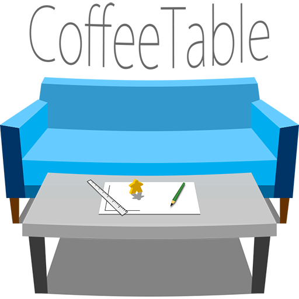

===========

**Board game prototyping tool project**

When some board game idea is popped in your mind, you should want to see if it's worth to make it real.
Even though, printing out all the images by ur personal printer, cut the paper, find some mistakes, print them again...
And finally call friends for the test etc.. is sometimes disgusting.
(And you might know, the first shape of idea tends to be rubbish)

CoffeeTable aims to share your board game prototyping easily along with your frineds, without calling them to your home.
You just need a CouchDB server, and a web browser to use this.
And moreover, your friend only need web browser with no-plugin stuff!

CoffeeTable doesn't aim to provide a great service to customers.
In fact, this doesn't provide any security stuff.
If you know Javascript and debugger, you easily can cheat your friend.
(but in prototyping point of view, it shouldn't be really a matter)

See [Wiki](https://github.com/giantroach/CoffeeTable/wiki) for more information.

